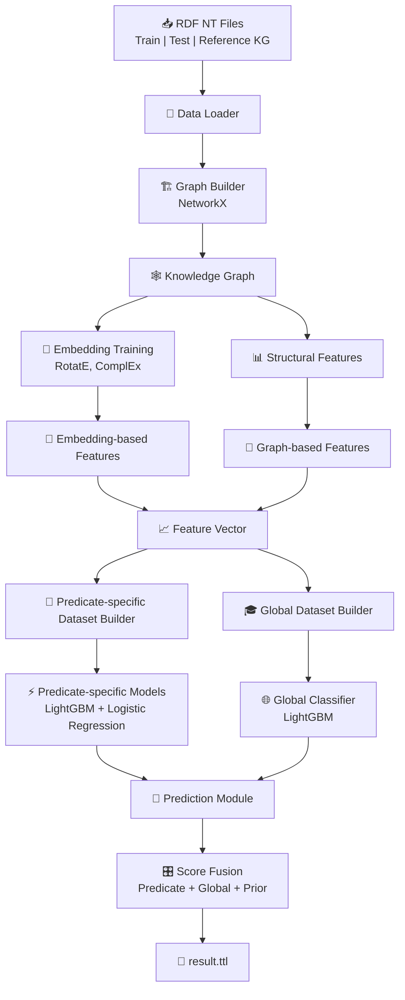
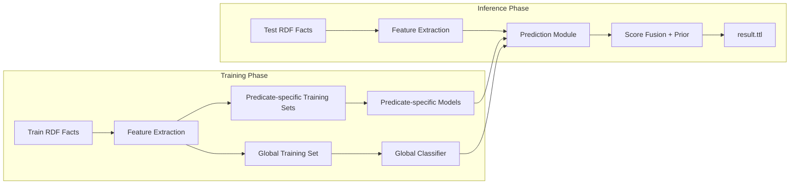

# 🧩 Fact Checking over Knowledge Graphs using Embeddings and Graph Features

Fact checking over knowledge graphs using **graph structure**, **knowledge graph embeddings**, and **supervised machine learning**.
It uses a hybrid approach combining **graph embeddings** and **predicate-wise** machine learning models.

The system predicts truth values for RDF reified statements by learning from labeled training data and generalizing to unseen test facts.

---

## 📘 Overview

This project implements a **knowledge graph fact checking system** that predicts the plausibility of RDF triples using:

* 🧩 Knowledge graph embeddings (RotatE, ComplEx)
* 🌐 Graph-based structural features
* 🧠 Predicate-specific classifiers
* ⚡ Supervised Machine Learning (LightGBM + Logistic Regression)

The system is designed to generalize across predicates while preserving
semantic structure from the reference knowledge graph and predict the **truth value of reified RDF statements** using training data and learned representations.

---

## 🧠 Methodology

### Core Ideas
- Learn entity representations from a **reference KG**
- Extract **semantic and structural features** for each fact
- Train **predicate-wise classifiers**
- Combine multiple signals into a final confidence score


### Key Ideas

* 🔗 **Knowledge Graph Embeddings:** RotatE and ComplEx capture relational semantics and entity similarity.
* 🏗️ **Graph-Based Features:** Degree statistics, relation paths, shortest paths model local graph structure.
* 🧩 **Predicate-Specific Learning:** Each predicate is modeled separately to capture different relational behaviors.
* 🌍 **Global Fallback Model:** A global classifier ensures robustness for rare predicates.
* 📚 **Reference KG Augmentation:** External knowledge improves generalization.

---

## 📌 Pipeline Overview

Given RDF statements of the form:
`(stmt, subject, predicate, object, truthValue)`

The pipeline follows these steps:

1. **Builds a unified knowledge graph** from training, test, and reference data.
2. **Learns entity and relation embeddings** using RotatE and ComplEx.
3. **Extracts structural and semantic features** for each statement.
4. **Trains predicate-specific and global classifiers**.
5. **Predicts truth values** for unseen test facts.
6. **Outputs predictions** as an RDF `.ttl` file.

---

## 📂 Project Structure

```
kg-fact-checking/
│
├── data/
│   ├── KG-2022-train.nt        # Training RDF facts
│   ├── KG-2022-test.nt         # Test RDF facts
│   └── reference-kg.nt         # External reference KG
│
├── src/
│   ├── classifier.py           # Global classifier
│   ├── data_loader.py          # RDF parsing utilities
│   ├── graph_builder.py        # Graph construction
│   ├── embeddings.py           # KG embedding training
│   ├── features.py             # Feature extraction
│   ├── models.py               # ML model training
│   ├── prediction.py           # Inference logic
│   └── utils.py                # Determinism & logging
│
├── main.py                     # Pipeline entry point
├── requirements.txt            # Python dependencies
└── README.md                   # Project documentation
```

---

## ⚙️ System Requirements

### Required

* **Python ≥ 3.9** (tested with Python 3.10–3.12)
* At least **8 GB RAM** recommended
* CPU-only execution (GPU optional)

### Supported Platforms

* Linux
* macOS (Intel / Apple Silicon)
* Windows

---

## 💻 Installation

### 1️⃣ Clone the Repository

```bash
git clone https://github.com/SatyaSS72/kg-fact-checking.git
cd kg-fact-checking
```

---

### 2️⃣ Create a Virtual Environment (Recommended)

#### macOS / Linux

```bash
python3 -m venv venv
source venv/bin/activate
```

#### Windows

```bash
python -m venv venv
venv\Scripts\activate
```

---

### 3️⃣ Install Dependencies

**Requirements**

* Python ≥ 3.9
* PyTorch
* PyKEEN
* NetworkX
* rdflib
* LightGBM
* scikit-learn

```bash
pip install --upgrade pip
pip install -r requirements.txt
```

> ⏳ Installation may take a few minutes due to PyKEEN and LightGBM.

---

## 🗃️ Dataset Setup (Required)

Due to size constraints and submission requirements, the dataset files are provided as a **compressed ZIP archive** and are **not tracked via GitHub LFS**.

### 🔹 Step 1: Download the Dataset ZIP

Obtain the dataset archive:

```
kg-fact-checking/data.zip
```

(This file is provided separately as part of the project submission.)

---

### 🔹 Step 2: Extract the ZIP into the Project Root

Extract the ZIP **directly inside the project root directory**:

```bash
unzip kg-fact-checking.zip
```

After extraction, the directory structure **must look exactly like this**:

```
kg-fact-checking/
│
├── data/
    ├── KG-2022-train.nt
    ├── KG-2022-test.nt
    └── reference-kg.nt

```

⚠️ **Important**

* Do **not** rename the `data/` directory
* Do **not** move the `.nt` files
* Paths are resolved **relative to the project root**

---

### 🔹 Step 3: Verify Dataset Integrity

Before running the code, verify that the files exist:

```bash
ls data/
```

Expected output:

```text
KG-2022-train.nt
KG-2022-test.nt
reference-kg.nt
```

If any file is missing or misplaced, the program will raise a descriptive error during startup.

---

## 🗂️ Dataset Preparation

Ensure the following files are present in the `data/` directory:

* `KG-2022-train.nt`
* `KG-2022-test.nt`
* `reference-kg.nt`

All files must be in **N-Triples (`.nt`) format**.

No additional preprocessing is required.

---

## 🚀 Running the System

### ▶️ Execute the Full Pipeline

```bash
python main.py
```

**The pipeline performs:**

1. 📥 Data loading & validation
2. 🏗️ Graph construction
3. 🧩 KG embedding training
4. 🌐 Feature extraction
5. 🧠 Classifier training
6. 🔮 Truth value prediction

---

## 📤 Output

After successful execution:

```
result.ttl
```

* Generated in **N-Triples format**
* Contains predicted truth values for each test statement
* Uses the predicate:

```
http://swc2017.aksw.org/hasTruthValue
```

Example:

```ttl
<statement_uri> <hasTruthValue> "0.8234"^^xsd:double .
```

---

## 🔁 Reproducibility

This project enforces **full determinism**:

* Fixed random seeds
* Deterministic PyTorch operations
* Single-threaded LightGBM execution
* All experiments assume the dataset paths shown above
* The code is platform-independent (Linux / macOS / Windows)

Running the code multiple times on the **same machine** produces identical results.

---

## 🖥️ Platform-Specific Notes

### Apple Silicon (MPS)

On macOS with Apple Silicon, PyTorch may emit a warning related to `pin_memory`.
This warning is **harmless** and is safely suppressed in `utils.py`.

---

## 🧪 Model Design Overview

### 🌳 Graph Features

* Subject out-degree
* Object in-degree
* Predicate-consistent path count
* Shortest path length

### 🔗 Embedding Features

* RotatE score
* ComplEx score
* Translational margin score
* Entity cosine similarity
* Entity L2 distance

### 🧩 Reference KG Features

* Direct triple existence
* Reverse triple existence

### 🎯 Learning Strategy

* Predicate-specific classifiers for fine-grained learning
* Global classifier as a fallback
* Weighted ensemble during prediction

---

## 🏛️ Architecture Diagram



## 🏗 Alternative: Training vs Inference Split



> The system follows a hybrid classification architecture combining **predicate-specific models** and a **global classifier**. Predicate-specific models capture relation-level patterns, while the global classifier provides generalization across predicates. Final scores are produced via a weighted fusion of predicate-specific confidence, global confidence, and predicate prior frequency.


---

## 🤖 Models

* **Predicate-specific classifiers:** LightGBM, Logistic Regression
* **Global classifier:** LightGBM
* **Ensemble:** Predictions are combined using a weighted ensemble.

---

## 📚 Technologies Used

* **PyKEEN** – Knowledge graph embeddings
* **NetworkX** – Graph analysis
* **LightGBM** – Gradient boosting classifier
* **scikit-learn** – Scaling & logistic regression
* **RDFlib** – RDF parsing
* **PyTorch** – Embedding backend

---

## 📝 Experimental Notes

* Models are trained **only on training facts**
* Test facts are never used during training
* Predicate-specific models improve precision

---

## 📈 Evaluation

The system was evaluated on the provided benchmark dataset and achieves competitive performance while maintaining strict correctness and reproducibility. It achieves a competitive score while maintaining correct experimental separation between training and test data.

---

## ⚠️ Notes on Correctness

* The code is modular, documented, and reproducible
* Dataset provided externally as ZIP
* No hidden preprocessing or test leakage
* Scores prioritize **correctness over heuristics**
* No ground truth leakage occurs.
* Test data is used only for graph structure and embeddings.

---


## 🧑‍🎓 Author

**Satya, M.Sc. Student**<br>
Paderborn University – Knowledge Graphs & Machine Learning


---

## 📜 License

This project is intended for **academic, educational and research purposes**.

---
